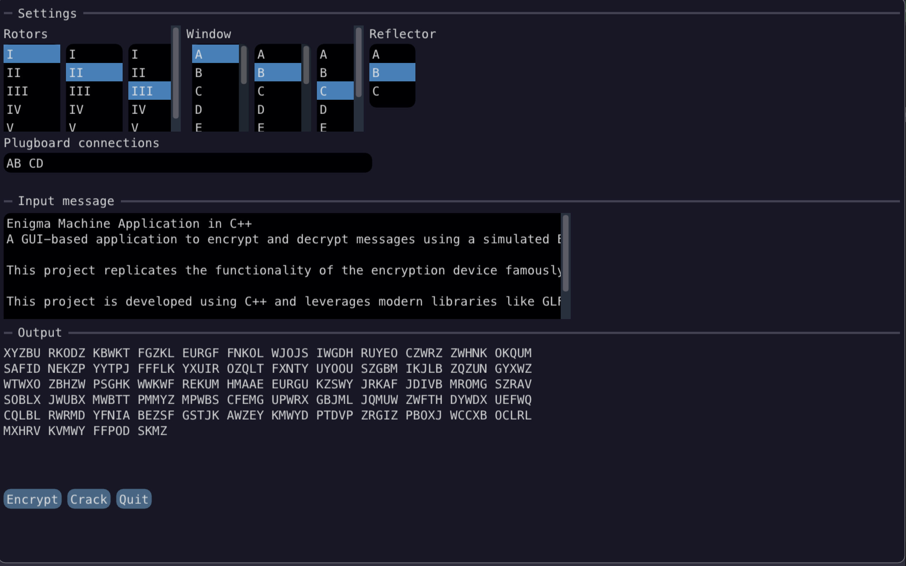

# Enigma Machine Application in C++

A GUI-based application to encrypt and decrypt messages using a simulated **Enigma machine**. This project replicates the functionality of the encryption device famously used during World War II, further detailed on [Wikipedia](https://en.wikipedia.org/wiki/Enigma_machine).

This project is developed using **C++** and leverages modern libraries like **GLFW**, **OpenGL**, and **Dear ImGui** for the graphical interface.



---


## Features

- Simulates an **Enigma Machine** that can encrypt and decrypt messages like the historical counterpart.
-  **Graphical User Interface (GUI)** for easy interaction.
- The crack function uses a frequency approach to guess the enigma settings used to generate an encrypted message.

---

## Prerequisites

Ensure the following tools are installed on your system before building the project:

- **C++ Compiler** (with C++17 support or later)
- **CMake** (version 3.28 or later)
- **Git** (for dependency fetching, if using FetchContent)
- **OpenGL** (installed on your system, often available by default)

---

## Dependencies

The project relies on the following libraries:

1. **GLFW**: For handling window creation, input, and OpenGL context.
2. **OpenGL**: For rendering the GUI and graphical representations.
3. **Dear ImGui**: For creating the GUI interface.

All dependencies will be automatically fetched and built using `FetchContent` (no manual setup required).

---

## How to Build

1. Clone the repository:
   ```bash
   git clone https://github.com/MatthewFTang/enigma_cpp.git
   cd enigma_cpp
   ```

2. Create a build directory and run CMake to configure the project:
   ```bash
   cmake -S . -B build
   ```

3. Build the project using the generated configuration:
   ```bash
   cmake --build build
   ```

4. Run the application:
   ```bash
   ./build/Enigma
   ```

---

## Directory Structure

```plaintext
enigma_cpp
├── assets/             # Contains assets such as font files, textures, configuration files, etc.
├── imgui/              # Dear ImGui source code
├── src/                # Source code for the application and Enigma machine simulation
├── CMakeLists.txt      # Main CMake configuration file
└── README.md           # This file
```

---

## Usage

- **Encryption/Decryption**: Enter a message in the GUI text input box and click the appropriate button to encrypt or decrypt the message.
- **Configuration**: Customize the Enigma machine settings (e.g., rotors, plugboards) to simulate different encryption modes.

---

## Contributing

Contributions are welcome! If you'd like to contribute, please follow these steps:

1. Fork the repository.
2. Create a new branch for your changes:
   ```bash
   git checkout -b feature-name
   ```
3. Commit your changes and push the branch:
   ```bash
   git commit -m "Description of changes"
   git push origin feature-name
   ```
4. Open a Pull Request detailing your changes.

---

## License

This project is licensed under the **MIT License**. See the `LICENSE` file for details.

---

## References

- [Enigma Machine - Wikipedia](https://en.wikipedia.org/wiki/Enigma_machine)
- [Dear ImGui Documentation](https://github.com/ocornut/imgui)
- [GLFW Documentation](https://www.glfw.org/docs/latest/)
